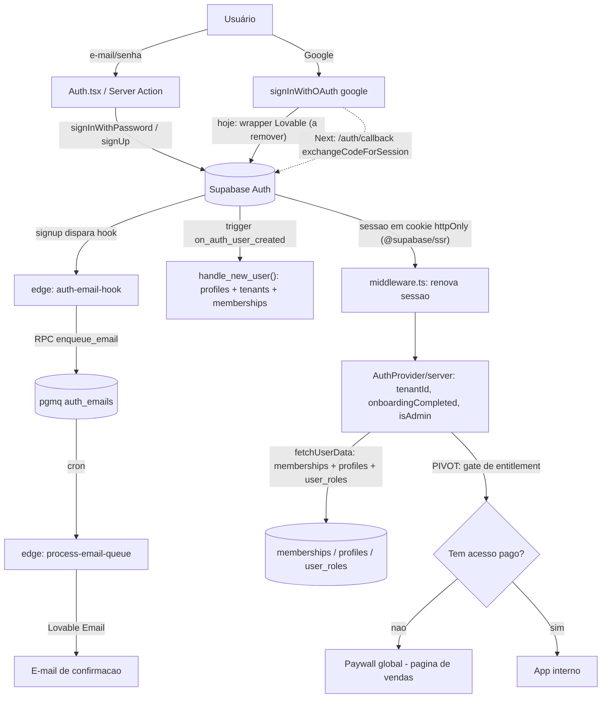
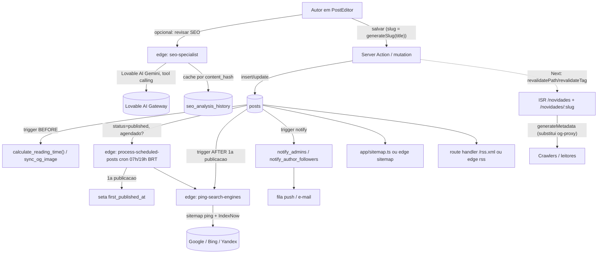
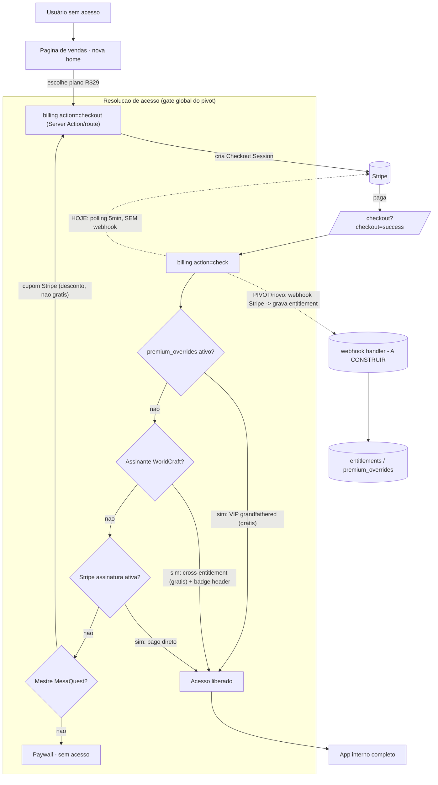
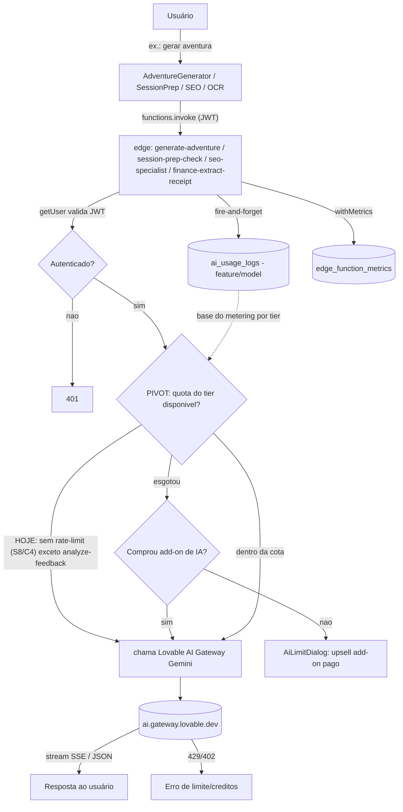

# Mapa de Interconexão — QG do Mestre (Nuckturp)

> **Objetivo:** explicar **como tudo se conecta em runtime** — feature → componentes/hooks → tabelas → edge functions → serviços externos — para servir de base à reescrita Next.js 16 App Router + Supabase próprio.
> **Fontes:** inventários (`docs/inventario/{modulos,schema,edge-functions,rotas-slugs}.md`) + consolidados de auditoria (`docs/auditoria/{seguranca-rls,auth-admin-secrets,edge-seguranca}.md`) + leituras pontuais do código antigo (READ-ONLY) em `D:\ProjetoAntigravity\Nuckturp_2.1\nuckturp` (`useAuth.tsx`, `useSubscription.ts`, `usePosts.ts`, `functions/billing`, `functions/generate-adventure`).
> **Data:** 2026-05-29. Reflete o **PIVOT 100% pago** (`docs/PIVOT-MODELO-PAGO.md`): QG inteiro atrás de paywall, Academia removida do app interno, IA limitada + add-on pago, tiers Pago/WorldCraft/MesaQuest/VIP-grandfathered.

---

## 0. Substrato compartilhado (todo runtime depende disto)

Antes das features, três peças que **toda** feature autenticada atravessa:

- **Sessão / tenancy** — `useAuth.tsx` (`AuthProvider`) é a raiz. No login, dispara `fetchUserData(userId)` com **3 queries paralelas**: `memberships` → `tenantId`; `profiles` → `onboarding_completed`/`locale`; `user_roles role=admin` → `isAdmin`. Expõe `{ session, user, tenantId, onboardingCompleted, isAdmin }`. Hoje sessão em `localStorage` (incompatível com SSR). **No Next:** `@supabase/ssr` (cookies httpOnly) + middleware; `isAdmin`/tenant resolvidos server-side.
- **Predicado de RLS central** — `get_user_tenant_id(auth.uid())` (`SECURITY DEFINER`). Toda tabela tenant-scoped (`campaigns`, `sessions`, `notes`, `whiteboards`, `players`, `finance_*`) filtra por ele. Eixo paralelo: `user_id = auth.uid()` (progresso, preferências, favoritos, push, `ai_usage_logs`).
- **Trigger fundacional** — `handle_new_user()` (`AFTER INSERT ON auth.users`) cria `profiles` + `tenants` + `memberships(role=owner)`. Sem ele, nada do eixo tenant funciona.

> **Pivot — paywall global:** no modelo novo, **acima** deste substrato entra um **gate de entitlement** (middleware/server) que verifica se o usuário tem acesso pago antes de servir qualquer rota do app interno. Hoje o billing só gateia features pontuais; passa a gatear o app inteiro. Páginas públicas de SEO (§ assumido C2) permanecem abertas.

---

## 1. Mapa feature → camadas

| Feature (ativa)                                  | Componentes / Hooks principais                                                                                                                                                                                                                            | Tabelas                                                                                                                                                                                                     | Edge functions                                                                                                                                                                                                                               | Serviços externos                                                                                             |
| ------------------------------------------------ | --------------------------------------------------------------------------------------------------------------------------------------------------------------------------------------------------------------------------------------------------------- | ----------------------------------------------------------------------------------------------------------------------------------------------------------------------------------------------------------- | -------------------------------------------------------------------------------------------------------------------------------------------------------------------------------------------------------------------------------------------- | ------------------------------------------------------------------------------------------------------------- |
| **Auth / Perfil / Onboarding**                   | `useAuth` (AuthProvider), `useProfile`, `useSubscription`; `Auth.tsx`, `Onboarding.tsx`, `Profile.tsx`, `PublicProfile.tsx` (`/m/:slug`), `ProtectedRoute`, `profile/*Tab`                                                                                | `auth.users`, `memberships`, `tenants`, `profiles`, `user_roles`, `premium_overrides`, `banned_emails`                                                                                                      | `auth-email-hook` (enfileira e-mail de auth), `og-profile-image` (OG do `/m/:slug`)                                                                                                                                                          | Supabase Auth; **Google OAuth via wrapper Lovable** (`@lovable.dev/cloud-auth-js` — a remover); Lovable Email |
| **Campanhas / Aventuras / Sessões**              | `useCampaigns`, `useSessions`, `useSessionPlayers`; `Campaigns.tsx`, `CampaignDetail.tsx`, `campaign/*`, `SessionChecklist`, `CampaignShareDialog`                                                                                                        | `campaigns`, `campaign_shares`, `sessions`, `session_players`                                                                                                                                               | — (CRUD direto via RLS)                                                                                                                                                                                                                      | export PDF (`lib/exportPdf.ts`, client)                                                                       |
| **Jogadores (CRM) / Personagens**                | `usePlayers`, `useCharacter`, `useCharacterRelationships`; `Players.tsx`, `PlayerDetail.tsx`, `CharacterDetail.tsx`, `character/*Tab`                                                                                                                     | `players`, `player_campaigns`, `character_inventory`, `character_relationships`, `character_session_notes`, `session_players`                                                                               | —                                                                                                                                                                                                                                            | —                                                                                                             |
| **Consentimento / LGPD** (sub-fluxo do CRM)      | `ConsentManagement.tsx` (`/tools/consent`), `ConsentForm.tsx` (`/c/:token`), `player/ConsentResponse*`                                                                                                                                                    | `consent_links` (⚠️ S1: hoje em `manual-scripts/`, não migrada — versionar com RLS), `players`                                                                                                              | — (RPCs `get_consent_form_info`, `submit_consent` `SECURITY DEFINER` por token)                                                                                                                                                              | —                                                                                                             |
| **Diário do Mestre / Notas (TipTap)**            | `useNotes`, `useFolders`, `useNoteShares`, `useNotePresence`, `useTemplates`; `NotionEditor`, `editor/*` (nodes custom), `FolderTree`, `NoteShareDialog`; `Diary.tsx`, `PublicNote.tsx` (`/n/:token`)                                                     | `notes`, `folders`, `note_shares`, `share_events`, `content_templates`                                                                                                                                      | — (RPC `get_public_note` por token; `og-proxy` para crawler de `/n/:token`)                                                                                                                                                                  | TipTap; Supabase **Realtime** (presença); DOMPurify                                                           |
| **Quadro de Ideias / Whiteboard**                | `useWhiteboard(s)`, `whiteboard/useWhiteboardHistory`/`Keyboard`/`ThrottledUpdate`; `WhiteboardEditor` + ~15 componentes (canvas DOM+SVG **próprio**, sem libs)                                                                                           | `whiteboards`, `whiteboard_items`                                                                                                                                                                           | —                                                                                                                                                                                                                                            | export PDF/PNG (client); itens cruzam campanhas/notas/sessões                                                 |
| **Blog / Dicionário / SEO**                      | `usePosts`, `usePostEditorForm`, `usePostFeatures`, `useAuthorBlog`, `useDictionary`, `useBlogSEO`, `useCanonical`, `usePageMeta`; `PostEditor.tsx`, `PublicBlog/Post`, `AuthorPublicBlog`, `PublicDictionary`, `DictionaryEntryPage`, `blog/PostEditor*` | `posts`, `post_categories`, `post_features`, `post_reactions`, `post_view_events`, `blog_authors`, `author_follows`, `dictionary_entries`, `menu_items`, `featured_links`, `seo_analysis_history`, `link_*` | `seo-specialist` (IA), `rss`, `sitemap`, `ping-search-engines`, `analyze-post-links`, `apply-link-corrections`, `fetch-og-image`, `import-wordpress`, `scraper`, `process-scheduled-posts`, `optimize-images`, `redirect-legacy`, `og-proxy` | Lovable AI Gateway (Gemini); Google/Bing/IndexNow; Firecrawl; WordPress (WXR); weserv.nl                      |
| **Ferramentas — Dados** (`/tools/dice-roller`)   | `DiceRoller.tsx`, `InlineDiceRoller`, `DiceIcons`, `lib/rpgConstants`                                                                                                                                                                                     | — (lógica local)                                                                                                                                                                                            | —                                                                                                                                                                                                                                            | —                                                                                                             |
| **Ferramentas — Gerador de aventuras (IA)**      | `AdventureGenerator.tsx`, `AiLimitDialog`, `AiSuggestionDialog`                                                                                                                                                                                           | `ai_usage_logs`                                                                                                                                                                                             | `generate-adventure` (stream SSE)                                                                                                                                                                                                            | Lovable AI Gateway (`gemini-3-flash`)                                                                         |
| **Ferramentas — Preparador de sessão (IA)**      | `SessionPrepCheck.tsx`                                                                                                                                                                                                                                    | `campaigns`, `sessions`, `ai_usage_logs`                                                                                                                                                                    | `session-prep-check`                                                                                                                                                                                                                         | Lovable AI Gateway                                                                                            |
| **Ferramentas — Feedback / NPS de sessão**       | `feedback/*` (`FeedbackConfigEditor`, `FeedbackDashboard`, `useAnalyzeMutation`); `FeedbackPage.tsx`, `SessionFeedback.tsx` (`/f/:token`)                                                                                                                 | `session_feedback_configs`, `session_feedback_responses`, `session_feedback_ai_analyses`, `feedback_view_events`, `ai_usage_logs`                                                                           | `analyze-feedback` (IA, quota 2/mês free)                                                                                                                                                                                                    | Lovable AI Gateway (`gemini-2.5-flash`)                                                                       |
| **Ferramentas — Finanças**                       | `useFinance`; `finance/*` (`MonthlyLedger`, `PricingCalculator`, `EvolutionForecast`), `lib/finance/{formulas,money}`                                                                                                                                     | `finance_settings`, `finance_pricing_models`, `finance_pricing_costs`, `finance_transactions`, `finance_receipts`; view `finance_monthly_summary`                                                           | `finance-extract-receipt` (IA-visão/OCR)                                                                                                                                                                                                     | Lovable AI Gateway (`gemini-3-flash` multimodal); Supabase **Storage** (`finance-receipts`)                   |
| **Notificações / Push (PWA)**                    | `usePushNotifications`, `useNotifications`, `useAdminNotifications`, `useConditionalNotifications`, `usePushClickTracker`; `PushNotificationPrompt`, `NotificationBell`, `PwaUpdateReloader`                                                              | `push_subscriptions`, `user_notifications`, `notifications`, `conditional_notifications`, `conditional_notification_logs`, `pending_push_queue`, `pwa_events`, `reengagement_logs`                          | `send-push` (VAPID), `process-push-queue` (cron 5min), `process-conditional-notifications` (cron), `process-email-queue` (cron pgmq)                                                                                                         | Web Push (FCM/Mozilla autopush) via VAPID; Service Worker `sw-push.js`; Lovable Email                         |
| **Busca global**                                 | `GlobalSearch` (`cmdk`), `useKeyboardShortcuts`                                                                                                                                                                                                           | lê `campaigns`, `notes`, `sessions`, `whiteboards`, `players`, `player_campaigns`                                                                                                                           | —                                                                                                                                                                                                                                            | —                                                                                                             |
| **Favoritos**                                    | `FavoriteButton`, `useFavorites`                                                                                                                                                                                                                          | `favorites` (polimórfico: note/campaign/session/post)                                                                                                                                                       | —                                                                                                                                                                                                                                            | —                                                                                                             |
| **Agenda / Dashboard**                           | `Agenda.tsx`, `dashboard/*` (Hero, Campaigns, Agenda, Notes, ContinueReading), `GameStatsCard`, `MasterBadges`                                                                                                                                            | `sessions`, `campaigns`, `notes`, `user_engagement_scores`                                                                                                                                                  | —                                                                                                                                                                                                                                            | `react-day-picker` (client)                                                                                   |
| **Admin (KPIs / Infra / Usuários / Financeiro)** | `useAdmin`, `useAdminQueries`, `useCdnCacheStats`, `useStorageUsage`, `useSiteSettings`; `admin/*` (~45 comp.), `platform/*`, `CronHealthSection`                                                                                                         | `site_settings`, `admin_cost_settings`, `edge_function_metrics`, `infra_snapshots`, `pwa_events`, `share_events`, `user_engagement_scores` + dezenas de RPC `admin_*`                                       | `admin-users` (router ~2.5k linhas: users/stats/Stripe/infra/notif), `optimize-images`, `instagram-thumbnail`, crons                                                                                                                         | Stripe (stats); invoca `send-push`                                                                            |
| **Financeiro / Billing (assinatura)**            | `useSubscription` (polling 5min → `billing check`); `Plans.tsx`, `CheckoutSuccess.tsx`, `landing/*`, `lib/plans`                                                                                                                                          | `premium_overrides`; (Stripe é a fonte da verdade de assinatura)                                                                                                                                            | `billing` (router: `check`/`checkout`/`portal`/`invoices`)                                                                                                                                                                                   | **Stripe** (`stripe@18.5.0`)                                                                                  |
| **~~Academia de Mestres~~**                      | **REMOVIDA no pivot** (PRD §4.8, módulo `academy/`, rotas `/journey/*`). Não mapear como feature ativa. Tabelas `academy_*` podem ser dropadas ou só ter UI/rotas removidas (decisão C6).                                                                 | —                                                                                                                                                                                                           | —                                                                                                                                                                                                                                            | —                                                                                                             |

> **Notas de pivot por feature:** (1) **IA limitada** — `generate-adventure`, `session-prep-check`, `seo-specialist`, `finance-extract-receipt` ganham quota/metering por tier + **add-on pago** (achado S8 vira requisito de produto). Hoje só `analyze-feedback` tem quota (2/mês free). (2) **Billing** deixa de ser opcional → torna-se o **gate global** do app. (3) **Header WorldCraft** — assinante WorldCraft recebe badge "🔓 assinante worldcraft". (4) **Cupom MesaQuest** — Stripe coupons. (5) **VIP grandfathered** — `premium_overrides` vira mecanismo central, não exceção.

---

## 2. Mapa de serviços externos → consumidores

| Serviço externo                                 | Para quê                                                                                                    | Quem consome (edge functions / camada)                                                                                   | Secret / lock-in                                                                                      |
| ----------------------------------------------- | ----------------------------------------------------------------------------------------------------------- | ------------------------------------------------------------------------------------------------------------------------ | ----------------------------------------------------------------------------------------------------- |
| **Stripe**                                      | Assinatura, checkout, portal, faturas, stats admin, cupons (MesaQuest)                                      | `billing` (`check`/`checkout`/`portal`/`invoices`), `admin-users` (`stripe-stats`)                                       | `STRIPE_SECRET_KEY`. **Sem webhook hoje** — status por polling (ver fluxo C).                         |
| **Lovable AI Gateway** (Google Gemini)          | Toda IA: gerar aventura, prep de sessão, SEO, análise de feedback, OCR de recibo                            | `generate-adventure`, `session-prep-check`, `seo-specialist`, `analyze-feedback`, `finance-extract-receipt`              | `LOVABLE_API_KEY` → `ai.gateway.lovable.dev`. **Lock-in Lovable a substituir** (Gemini direto/outro). |
| **Lovable Email** (`@lovable.dev/email-js`)     | Envio transacional/auth (signup, invite, magic-link, recovery)                                              | `auth-email-hook` (renderiza+enfileira), `process-email-queue` (dispara fila pgmq)                                       | `LOVABLE_API_KEY` + `LOVABLE_SEND_URL`. **Lock-in** (candidato a Resend).                             |
| **Web Push / VAPID**                            | Notificações push no navegador (PWA)                                                                        | `send-push` (cripto RFC 8291 manual), via `process-push-queue`                                                           | `VAPID_PUBLIC_KEY`/`VAPID_PRIVATE_KEY`/`VAPID_SUBJECT`                                                |
| **Google / Bing / IndexNow**                    | Ping de indexação de posts novos                                                                            | `ping-search-engines` (chamada por `process-scheduled-posts` + trigger `trg_ping_search_engines`)                        | ⚠️ chave IndexNow **hardcoded** (`nuckturp2026indexnow`, S3) — mover p/ `INDEXNOW_KEY`                |
| **Firecrawl**                                   | Scraping de mundos WorldCraft                                                                               | `scraper` (caminho `worldcraft`)                                                                                         | `FIRECRAWL_API_KEY`                                                                                   |
| **Instagram / Gravatar / OG remoto**            | Thumbnails IG, avatares import WP, og:image de URLs                                                         | `instagram-thumbnail` (⚠️ SSRF S2), `fetch-og-image` (⚠️ SSRF S2), `import-wordpress`                                    | — / nenhum                                                                                            |
| **Google OAuth**                                | Login social                                                                                                | Hoje via wrapper Lovable (`@lovable.dev/cloud-auth-js`); **migrar p/ Supabase Auth nativo** com mesmo `client_id/secret` | OAuth Google                                                                                          |
| **Cloudflare** (Worker + `cdn.nuckturp.com.br`) | Hoje: roteia crawlers p/ `og-proxy`, proxy XML (sitemap/rss), rewrite CDN bucket→storage, redirects legados | Worker (a **aposentar** no Next — SSR nativo + `next.config` redirects + `app/sitemap.ts`/`robots.ts`)                   | —                                                                                                     |
| **Google Analytics**                            | Telemetria de uso                                                                                           | `site_settings.google_config` (config no admin)                                                                          | GA config                                                                                             |
| **Supabase Storage**                            | Buckets: `profile-assets`, `blog-assets`, `email-assets`, `feedback-*`, `finance-receipts`                  | `optimize-images` (blog), `finance-extract-receipt` (recibos), perfis/posts                                              | políticas por pasta de usuário / admin                                                                |

---

## 3. Fluxos críticos (Mermaid)

### 3.a Autenticação (e-mail/senha + Google + sessão cookie SSR)

### 3.b Publicar post (editor → Server Action → SEO IA → revalidate → sitemap/RSS)

### 3.c Pagamento / Paywall (checkout Stripe → entitlement → tiers do pivot)

### 3.d Geração por IA (request → quota/metering do pivot → edge IA → add-on)

---

## 4. Observações de runtime que mudam na reescrita

- **Webhook Stripe ausente** — hoje o entitlement é resolvido on-demand por `billing check` (polling 5min em `useSubscription`, consulta `stripe.subscriptions.list` direto). Com paywall global, vale materializar entitlement via **webhook → tabela** (latência e custo de chamada por request). É o item "novo a construir" mais relevante do fluxo C.
- **SEO client-side → server** — `usePageMeta`/`useCanonical`/`og-proxy` (HTML para crawler) somem; `generateMetadata` + SSR/ISR nativos substituem. Worker Cloudflare aposentado.
- **IA sem quota → metered** — S8 (segurança) + C4 (produto) convergem: contador por `ai_usage_logs` vira enforcement por tier + add-on. `analyze-feedback` (quota 2/mês) é o modelo a replicar.
- **`consent_links` não migrada** (S1) — existe em `manual-scripts/`, fora das migrations. Versionar com RLS antes do port (LGPD).
- **Crons** — só 2 jobs `pg_cron` reais hoje (fila de e-mail + purge de métricas); push/notif/scheduled-posts dependiam de scheduler externo (tier free antigo). Reconfirmar quais viram `pg_cron` nativo.

---

_Documento de interconexão. Atualizar conforme C1–C7 do pivot forem resolvidos e o schema for reconstruído na Fase 1._
